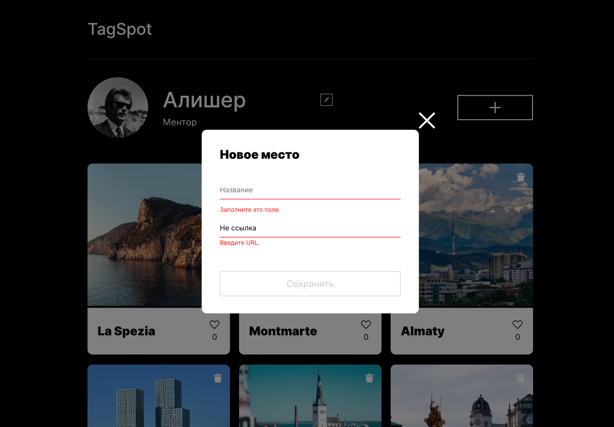
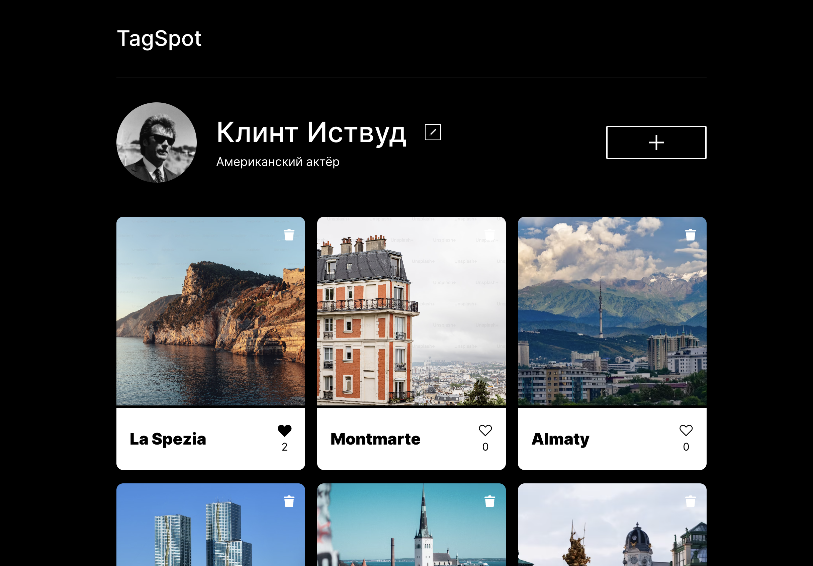
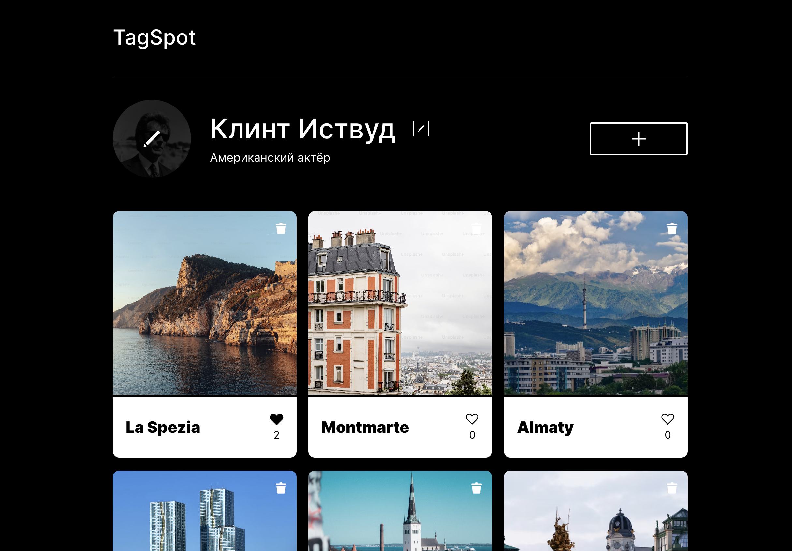
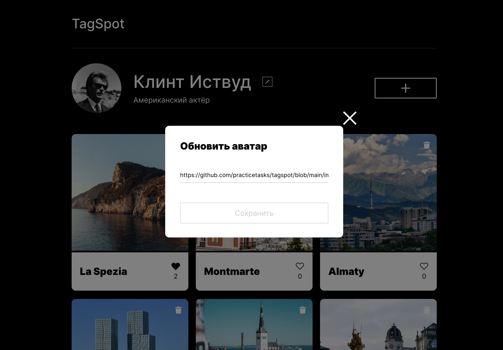
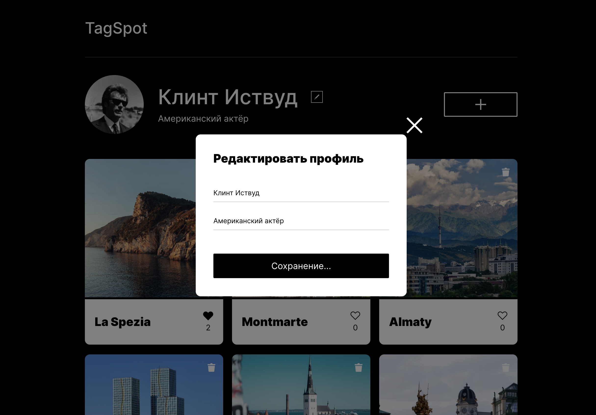

# Проектная работа TagSpot. Валидация форм, интеграция с API и деплой.

Мы подошли к той самой большой проектной работе, которую обещали. Волноваться не стоит — вы уже умеете все, чтобы ее
реализовать. В ходе этой проектной работы вы:

* разработаете валидацию всех форм;
* подключите интерфейс к API;
* опубликуете получившийся сайт на сервере.



Так будет выглядеть готовая проектная работа

Начнем по порядку, с валидации форм.

## Валидация форм

### 1. Валидация формы «Редактировать профиль»

Валидируйте форму «Редактировать профиль». Для этого заготовьте элементы
ошибок [по макету в «Фигме»](https://www.figma.com/design/l2EBMmivrGVE8ZOqAYF5CI/TagSpot-validation?node-id=0-1&p=f&t=2bulcsSh4wVgZ9rB-0).


[//]: # ()
_Так работает валидация формы «Редактировать профиль»_

Если поле формы «Редактировать профиль» не прошло валидацию, под ним должен появиться красный текст ошибки.

Настройки валидации такие:

* Оба поля обязательные.
* В поле «Имя» должно быть от 2 до 40 символов.
* В поле «О себе» должно быть от 2 до 200 символов.
* Оба поля могут содержать только латинские и кириллические буквы, знаки дефиса и пробелы. Это нужно проверить с помощью
  регулярных выражений и вывести кастомное сообщение об ошибке.

Во всех остальных случаях используйте стандартные браузерные тексты ошибок.

Если хотя бы одно из полей не прошло валидацию, кнопка «Сохранить» должна быть неактивной. Если оба поля прошли —
активной. Цвета неактивных кнопок
возьмите [из макета](https://www.figma.com/design/l2EBMmivrGVE8ZOqAYF5CI/TagSpot-validation?node-id=0-1&p=f&t=2bulcsSh4wVgZ9rB-0).

Важно: при открытии модального окна редактирования профиля в поля формы подставляются валидные данные пользователя. Если
открыть модальное окно редактирования профиля, ввести невалидные данные в поля ввода и закрыть окно, то при повторном
открытии и заполнении данных формы профиля необходимо вызвать очистку ошибок валидации, которые могли остаться с
прошлого открытия.

### 2. Валидация формы «Новое место»

Валидируйте форму добавления места. Задание аналогично предыдущему, но есть отличия:

1. Не нужна проверка длины текста у поля ссылки.
2. Нужна проверка того, что пользователь ввёл именно ссылку.

[//]: # ()

_Так работает валидация формы «Новое место»_

Настройки валидации такие:

* Оба поля обязательные.
* В поле «Название» должно быть от 2 до 30 символов.
* В поле «Ссылка на картинку» должен быть URL.
* Поле «Название» может содержать латинские и кириллические буквы, знаки дефиса и пробелы. Нужно проверить с помощью
  регулярных выражений и вывести кастомное сообщение об ошибке.

И снова используйте стандартные браузерные тексты ошибок, кроме проверки регулярным выражением.

Если хотя бы одно из полей не прошло валидацию, кнопка «Сохранить» должна быть неактивной. Если оба поля прошли —
активной. Цвета неактивных кнопок те же.

Важно: после добавления карточки на страницу форма очищается, при повторном открытии модального окна поля формы должны
быть пустыми. Поэтому при очистке формы добавления карточки нужно вызвать задание неактивного состояния кнопке отправки,
чтобы она не оставалась активной при повторном открытии модального окна с пустыми полями ввода.

### 3. Требования к коду валидации

Разбейте код валидации на функции. Подробнее об этом говорится в теме «Валидация форм». Сделайте функцию
`enableValidation` ответственной за включение валидации всех форм. Пусть она принимает все нужные функциям классы и
селекторы элементов как объект настроек.

```js
// включение валидации вызовом enableValidation
// все настройки передаются при вызове

enableValidation({
    formSelector: '.popup__form',
    inputSelector: '.popup__input',
    submitButtonSelector: '.popup__button',
    inactiveButtonClass: 'popup__button_disabled',
    inputErrorClass: 'popup__input_type_error',
    errorClass: 'popup__error_visible'
});
```

В случае, если в поля «Имя» или «Название» введён любой символ, кроме латинской буквы, кириллической буквы и дефиса,
вывести кастомное сообщение об ошибке: `"Разрешены только латинские, кириллические буквы, знаки дефиса и пробелы"`.
Текст
ошибки разместить в data-* атрибуте поля ввода.

Создайте функцию `clearValidation`, которая очищает ошибки валидации формы и делает кнопку неактивной. Эта функция
должна принимать как параметры DOM-элемент формы, для которой очищаются ошибки валидации и объект с настройками
валидации. Используйте функцию `clearValidation` при заполнении формы профиля во время её открытия и при очистке формы
добавления карточки.

```js
// очистка ошибок валидации вызовом clearValidation

clearValidation(profileForm, validationConfig);
```

Вынесите функциональность валидации форм в файл `validation.js`. Чтобы было чуточку понятнее — пример выше, вызов
функций `enableValidation` и `clearValidation` должен находиться в файле `index.js`. А все другие функции, включая
декларирование функции `enableValidation` и валидации форм, — в отдельном файле `validation.js`.

## Интеграция с API

После реализации валидации, вам предстоит подключить проект TagSpot к серверу.

### 1. Перед стартом. Необходимая информация

Для выполнения этого задания вам понадобится дополнительная информация — личный токен:

```
3192ef699a1148b2180efd483511543aOJwy10u14J — так выглядит токен
```

Вы получите их в личных сообщениях. Если по какой-то причине вы не получили эти данные, напишите преподавателю.

Токен нужен для того, чтобы сервер умел различать пользователей. Он принадлежит только вам, не делитесь им с другими
студентами.

При авторизации на каком-нибудь сайте, например в социальной сети, обычно вводят логин и пароль. Эти логин и пароль
отправляются на сервер, а сервер взамен присылает уникальный токен. Когда вы делаете новые запросы к серверу, они должны
содержать этот токен, чтобы сервер понял, что запросы исходят от вас.

Вы получили этот токен сразу. Мы пропустили шаг с обменом логина и пароля на токен. Иначе весь месяц пришлось бы
потратить только на его реализацию. Но через несколько месяцев вы научитесь обменивать логин и пароль на токен за 30
строк кода.

### 2. Перед стартом. Как сделать запрос к серверу

Адрес сервера проекта TagSpot: https://practicetasks.kz/tagspot.

При каждом запросе нужно передавать токен. Вот пример запроса одного студента:

```js
return fetch('https://practicetasks.kz/tagspot', {
    headers: {
        authorization: '3192ef699a1148b2180efd483511543aOJwy10u14J'
    }
})
.then(res => res.json())
.then((result) => {
    console.log(result);
});
```

Обратите внимание, что при запросе нужно передавать токен в заголовке `authorization`. Это необходимое условие. Если не
передать серверу токен или передать неправильный — сервер ответит ошибкой. Делайте это в каждом запросе.

### 3. Загрузка информации о пользователе с сервера

Информация о пользователе должна подгружаться с сервера. Чтобы осуществить это, сделайте GET-запрос на URL:

```
GET https://practicetasks.kz/tagspot/users/me
```

При запросе не забудьте передать токен. Если запрос прошёл успешно, в ответе вы получите объект пользователя:

```
{
    "id": "fcb23cdf-aedc-4bdb-90aa-17f59e4d2e51",
    "name": "Клинт Иствуд",
    "about": "Американский актёр",
    "avatar": "https://github.com/practicetasks/tagspot/blob/main/images/avatar.png?raw=true"
}
```

Используйте свойства `name`, `about` и `avatar` в соответствующих элементах шапки страницы. Свойство `id` —
идентификатор
пользователя, в данном случае вашего.

### 4. Загрузка карточек с сервера

Начальные карточки должны подгружаться с сервера. Для этого сделайте GET-запрос:

```
GET https://practicetasks.kz/tagspot/cards
```

В ответ придёт JSON с массивом карточек, которые загрузили студенты:

```json
[
  {
    "id": "680313f8-cc43-4e6d-887a-9214d95a789d",
    "name": "La Spezia",
    "link": "https://plus.unsplash.com/premium_photo-1721654789105-43ff4bb0a486?q=80&w=2940&auto=format&fit=crop&ixlib=rb-4.1.0&ixid=M3wxMjA3fDB8MHxwaG90by1wYWdlfHx8fGVufDB8fHx8fA%3D%3D",
    "owner": {
      "id": "fcb23cdf-aedc-4bdb-90aa-17f59e4d2e51",
      "name": "Клинт Иствуд",
      "about": "Американский актёр",
      "avatar": "https://github.com/practicetasks/tagspot/blob/main/images/avatar.png?raw=true"
    },
    "createdAt": "2025-02-15T04:08:52",
    "likes": [
      {
        "id": "fcb23cdf-aedc-4bdb-90aa-17f59e4d2e51",
        "name": "Клинт Иствуд",
        "about": "Американский актёр",
        "avatar": "https://github.com/practicetasks/tagspot/blob/main/images/avatar.png?raw=true"
      }
    ]
  },
  {
    "id": "3c18a523-0b2d-4223-8ea0-ac5bc55fb6e9",
    "name": "Montmarte",
    "link": "https://plus.unsplash.com/premium_photo-1718285549990-74ef9fb74946?q=80&w=3087&auto=format&fit=crop&ixlib=rb-4.1.0&ixid=M3wxMjA3fDB8MHxwaG90by1wYWdlfHx8fGVufDB8fHx8fA%3D%3D",
    "owner": {
      "id": "fcb23cdf-aedc-4bdb-90aa-17f59e4d2e51",
      "name": "Клинт Иствуд",
      "about": "Американский актёр",
      "avatar": "https://github.com/practicetasks/tagspot/blob/main/images/avatar.png?raw=true"
    },
    "createdAt": "2025-02-15T04:08:52",
    "likes": []
  }
]
```

Используйте этот массив при отображении предзагруженных карточек, а от предыдущего способа отображения первоначальных
карточек избавьтесь.

У каждой карточки есть свойства `name` и `link` — это заголовок и ссылка на картинку — они понадобятся при отображении
каждой отдельной карточки.

Как видите, у карточки также есть идентификатор — свойство `id`. Сейчас он вам не нужен, но скоро понадобится.

Обратите внимание, что для правильного отображения состояния кнопок лайка и удаления карточек необходимо знать `id`
пользователя. Его мы получаем только в ответе на запрос данных пользователя, и отображать карточки на странице следует
только после его получения. Поэтому для загрузки данных пользователя и карточек необходимо воспользоваться методом
`Promise.all()`. В него передается массив промисов, которые должны быть выполнены, т.е. наши запросы, а в блок `.then`
мы попадем когда оба запроса будут выполнены. Тем самым это гарантирует, что у нас будет сразу и массив карточек и `id`
пользователя для их отображения.

### 5. Редактирование профиля

Отредактированные данные профиля должны сохраняться на сервере. Для этого отправьте запрос методом PATCH:

```
PATCH https://practicetasks.kz/tagspot/users/me 
```

В заголовках запроса, кроме токена, необходимо отправить `Content-Type`, а в теле — JSON с двумя свойствами — `name` и
`about`. Значениями этих свойств должны быть обновлённые данные пользователя. Вот пример такого запроса:

```js
fetch('https://practicetasks.kz/tagspot/users/me ', {
    method: 'PATCH',
    headers: {
        authorization: '3192ef699a1148b2180efd483511543aOJwy10u14J',
        'Content-Type': 'application/json'
    },
    body: JSON.stringify({
        name: 'НОВОЕ ИМЯ ПОЛЬЗОВАТЕЛЯ',
        about: 'НОВОЕ ОПИСАНИЕ'
    })
});
```

Если обновление прошло успешно, в теле ответа от сервера вы получите обновлённые данные пользователя:

```json
{
  "id": "fcb23cdf-aedc-4bdb-90aa-17f59e4d2e51",
  "name": "НОВОЕ ИМЯ ПОЛЬЗОВАТЕЛЯ",
  "about": "НОВОЕ ОПИСАНИЕ",
  "avatar": "https://github.com/practicetasks/tagspot/blob/main/images/avatar.png?raw=true"
}
```

Метод PATCH обычно используют для обновления сущностей, уже существующих на сервере. Обновление информации о
пользователе — именно такой случай: пользователь уже есть, нужно просто обновить его данные.

### 6. Добавление новой карточки

Чтобы добавить на сервер новую карточку, отправьте POST-запрос:

```
POST https://practicetasks.kz/tagspot/cards 
```

В заголовках запроса, кроме токена, необходимо отправить `Content-Type`, а в теле — JSON с двумя свойствами — `name` и
`link`. В `name` должно быть название создаваемой карточки, а в `link` — ссылка на картинку. Если запрос прошёл успешно,
сервер вернёт ответ с объектом новой карточки:

```json
{
  "id": "3c18a523-0b2d-4223-8ea0-ac5bc55fb6e9",
  "name": "Montmarte",
  "link": "https://plus.unsplash.com/premium_photo-1718285549990-74ef9fb74946?q=80&w=3087&auto=format&fit=crop&ixlib=rb-4.1.0&ixid=M3wxMjA3fDB8MHxwaG90by1wYWdlfHx8fGVufDB8fHx8fA%3D%3D",
  "owner": {
    "id": "fcb23cdf-aedc-4bdb-90aa-17f59e4d2e51",
    "name": "Клинт Иствуд",
    "about": "Американский актёр",
    "avatar": "https://github.com/practicetasks/tagspot/blob/main/images/avatar.png?raw=true"
  },
  "createdAt": "2025-02-15T04:08:52",
  "likes": []
}
```

### 7. Отображение количества лайков карточки

У каждой карточки есть свойство `likes` — оно содержит массив пользователей, лайкнувших карточку:

```json
{
  "likes": [],
  ...другие
  данные
  карточки
}
```

Сделайте так, чтобы на каждой карточке было написано, сколько у неё лайков:



Это выглядит так

Для этого придётся сверстать дополнительный элемент.
Его [дизайн есть в Figma](https://www.figma.com/design/ilmaHQtDdAxPFHorPtQrfk/%D0%9F%D1%80%D0%BE%D0%B5%D0%BA%D1%82%D0%BD%D0%B0%D1%8F-%D1%80%D0%B0%D0%B1%D0%BE%D1%82%D0%B0-%22TagSpot%22-%D1%81-%D0%BB%D0%B0%D0%B9%D0%BA%D0%B0%D0%BC%D0%B8?node-id=0-1&p=f&t=PndlrRxtOoekkKvM-0).

### 8. Удаление карточки

Прежде чем браться за работу с API, исправьте элемент карточки. Сделайте так, чтобы иконка удаления была только на
созданных вами карточках, так как удалять чужие карточки нельзя.

Если карточка создана не вами, на ней нет иконки корзины.

Чтобы удалить карточку, отправьте DELETE-запрос:

```
DELETE https://practicetasks.kz/tagspot/cards/cardId
```

Вместо `cardId` в URL нужно подставить параметр `id` карточки, которую нужно удалить. `id` каждой карточки есть в её
JSON:

```json
{
  "likes": [],
  "id": "5d1f0611d321eb4bdcd707dd", — вот он
  ...другие данные карточки
}
```

В результате запрос на удаление этой карточки должен выглядеть так:

```
DELETE https://practicetasks.kz/tagspot/cards/5d1f0611d321eb4bdcd707dd
```

### 9. Постановка и снятие лайка

Чтобы лайкнуть карточку, отправьте PUT-запрос:

```
PUT https://practicetasks.kz/tagspot/cards/likes/cardId
```

Чтобы убрать лайк, нужно отправить DELETE-запрос с тем же URL:

```
DELETE https://practicetasks.kz/tagspot/cards/likes/cardId
```

Вместо `cardId` в URL нужно подставить свойство `id` соответствующей карточки.

В ответе придёт обновлённый JSON с карточкой. Массив лайков в нём будет уже обновлён.

При постановке и снятии лайка сердечко должно менять цвет, а счётчик лайков увеличиваться или уменьшаться.

Чтобы изменить количество лайков, нужно отправить на сервер запрос с соответствующим методом. Рекомендуем брать
количество лайков из ответа сервера, а не из вёрстки. Иначе могут возникнуть ошибки, когда два пользователя одновременно
лайкнут одну карточку.

### 10. Обновление аватара пользователя

Чтобы сменить аватар, отправьте такой PATCH-запрос:

```
PATCH https://practicetasks.kz/tagspot/users/me/avatar 
```

В теле запроса передайте JSON с единственным свойством — `avatar`. Это свойство должно хранить ссылку на новый аватар.
Если отправить не ссылку, сервер вернёт ошибку.

При наведении указателя мыши на аватар, на нём должна появляться иконка редактирования:



А при клике — открываться форма. Эту форму нужно сделать. В ней должно быть одно поле — ссылка на новый аватар:



Иконка редактирования аватара и форма
загрузки [есть в Figma](https://www.figma.com/design/ilmaHQtDdAxPFHorPtQrfk/%D0%9F%D1%80%D0%BE%D0%B5%D0%BA%D1%82%D0%BD%D0%B0%D1%8F-%D1%80%D0%B0%D0%B1%D0%BE%D1%82%D0%B0-%22TagSpot%22-%D1%81-%D0%BB%D0%B0%D0%B9%D0%BA%D0%B0%D0%BC%D0%B8?node-id=231439-2&t=Q8DtK5QEKjAWeURZ-0).

Хоть в этой форме и всего одно поле, но его тоже необходимо валидировать:

1. Поле обязательное
2. Поле содержит именно URL в корректном формате

### 11. Улучшенный UX всех форм

Поработайте над UX. При редактировании профиля уведомите пользователя о процессе загрузки, поменяв текст кнопки на:
«Сохранение...», пока данные загружаются:



Сделайте то же самое для формы добавления новой карточки и обновления аватара.

### 12. Требования к коду интеграции с API

Для работы с API создайте файл `api.js`. Все запросы присвойте переменным и экспортируйте их. В других модулях вы
сможете импортировать эти функции и вызывать их. Вот небольшой пример того, как можно обустроить код в файле `api.js`:

```js
const config = {
    baseUrl: 'https://practicetasks.kz/tagspot',
    headers: {
        authorization: '3192ef699a1148b2180efd483511543aOJwy10u14J',
        'Content-Type': 'application/json'
    }
}

export const getInitialCards = () => {
    return fetch('', {})
    // ...
}
```

### 13. Общие комментарии

**1. Не забывайте проверять, всё ли в порядке с ответом**. Для этого можно использовать `res.ok` или `res.status`:

```js
const config = {
    baseUrl: 'https://practicetasks.kz/tagspot',
    headers: {
        authorization: '3192ef699a1148b2180efd483511543aOJwy10u14J',
        'Content-Type': 'application/json'
    }
}

export const getInitialCards = () => {
    return fetch(`${config.baseUrl}/cards`, {
        headers: config.headers
    })
        .then(res => {
            if (res.ok) {
                return res.json();
            }
        });
}
```

**2. Учитывайте случай, когда сервер вернул ошибку:**

```js
const config = {
    baseUrl: 'https://practicetasks.kz/tagspot',
    headers: {
        authorization: '3192ef699a1148b2180efd483511543aOJwy10u14J',
        'Content-Type': 'application/json'
    }
}

export const getInitialCards = () => {
    return fetch(`${config.baseUrl}/cards`, {
        headers: config.headers
    })
        .then(res => {
            if (res.ok) {
                return res.json();
            }

            // если ошибка, отклоняем промис
            return Promise.reject(`Ошибка: ${res.status}`);
        });
}
```

**3. Обрабатывайте ошибки, которые попадают в catch**. Если запрос не ушёл на сервер или тот не ответил, сработает блок
catch. Обрабатывайте ошибку внутри этого блока. Если нет времени писать сложную логику, просто выведите ошибку в
консоль:

```js
import {getInitialCards} from './api.js'

getInitialCards()
    .then((result) => {
        // обрабатываем результат
    })
    .catch((err) => {
        console.log(err); // выводим ошибку в консоль
    });
```

### Деплой на GitHub Pages

Сейчас в репозиторий загружены исходные файлы вашего проекта, но вам нужно собрать их и уже в собранном виде
опубликовать для конечного пользователя.